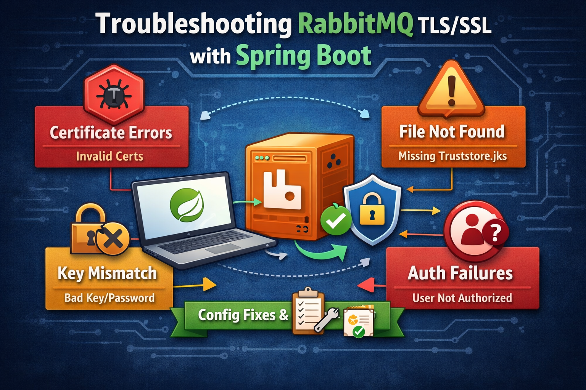

+++
title = "How to Setup RabbitMQ SSL on Windows"
date = 2025-01-31
description = "Setting up SSL/TLS for RabbitMQ on Windows can be challenging, especially when it comes to generating certificates and configuring secure connections. This comprehensive guide walks you through the entire process, from installing prerequisites to verifying your SSL setup."
+++



Setting up SSL/TLS for RabbitMQ on Windows can be challenging, especially when it comes to generating certificates and configuring secure connections. Whether you're securing message queues for production environments or setting up encrypted communication for distributed systems, proper SSL configuration is essential. In this guide, we'll walk through the complete process of setting up RabbitMQ with SSL on Windows, including certificate generation, server configuration, and verification.

<!-- more -->

## Why Use SSL with RabbitMQ?

Enabling SSL/TLS for RabbitMQ provides several critical security benefits:

- Encrypts data in transit between clients and the RabbitMQ server, protecting sensitive message content
- Authenticates clients and servers using certificates, ensuring only authorized parties can connect
- Prevents man-in-the-middle attacks by verifying the identity of communicating parties
- Meets compliance requirements for handling sensitive data in production environments

## Prerequisites

Before you begin, ensure you have the following installed on your Windows system:

- RabbitMQ server
- OpenSSL
- Python 3
- Make utility
- Git

If you don't have these tools installed, you can use Chocolatey, a package manager for Windows, to install them quickly.

### Installing Chocolatey

If you don't have Chocolatey installed, open PowerShell as Administrator and run:

```powershell
Set-ExecutionPolicy Bypass -Scope Process -Force; [System.Net.ServicePointManager]::SecurityProtocol = [System.Net.ServicePointManager]::SecurityProtocol -bor 3072; iex ((New-Object System.Net.WebClient).DownloadString('https://community.chocolatey.org/install.ps1'))
```

### Installing Required Tools

Once Chocolatey is installed, install the required tools:

```bash
choco install openssl
choco install make
choco install git
choco install python
```

After installation, verify that the commands are available in your terminal by running:

```bash
openssl version
python --version
make --version
hostname
git --version
```

**Important Note for Windows Users**: After installing OpenSSL or other tools via Chocolatey, you may need to refresh your environment variables. You can do this by:

- Closing and reopening your terminal, or
- Running `refreshenv` in PowerShell (if using Chocolatey)

## Step-by-Step Guide to Setup RabbitMQ SSL

Here's how you can configure RabbitMQ to use SSL/TLS encryption on Windows.

### 1. Generate SSL Certificates

RabbitMQ requires three types of certificates: a Certificate Authority (CA) certificate, a server certificate, and client certificates. We'll use the `tls-gen` tool developed by the RabbitMQ team to generate these certificates.

Clone the tls-gen repository:

```bash
git clone https://github.com/michaelklishin/tls-gen
cd tls-gen/basic
```

**Windows-Specific Fix**: The `tls-gen` Makefile assumes Unix naming conventions and looks for `python3`, but Windows uses `python`. To fix this, edit the `common.mk` file in the `tls-gen/basic` directory:

```makefile
PYTHON ?= python
```

Change the line from `PYTHON ?= python3` to `PYTHON ?= python`. This ensures the Makefile uses the correct Python command on Windows.

Generate certificates with a password. In this example, we'll use "changeit" as the password for all certificates:

```bash
make PASSWORD=changeit
```

Verify the generated certificates:

```bash
make verify
```

View certificate information:

```bash
make info
```

This process generates the following files in the `basic` directory:

**Certificate Authority (CA):**

- `testca/cacert.pem` - Certificate Authority certificate (root CA)

**Server Certificates:**

- `server_<hostname>/cert.pem` - Server certificate
- `server_<hostname>/key.pem` - Server private key (encrypted if password used)
- `server_<hostname>/keycert.p12` - Server PKCS#12 bundle (cert + key)

**Client Certificates:**

- `client_<hostname>/cert.pem` - Client certificate
- `client_<hostname>/key.pem` - Client private key (encrypted if password used)
- `client_<hostname>/keycert.p12` - Client PKCS#12 bundle (cert + key)

Where `<hostname>` is your computer's hostname (e.g., `WIN-NODE-01`).

**Important Notes**:

- When using `PASSWORD=changeit`, the private keys in the `.pem` files are encrypted and require the password to be used
- The `.p12` (PKCS#12) files already contain both the certificate and private key bundled together

**Important Note**: Using a password for your certificates adds an extra layer of security. If you choose to use a password, you must specify it in the RabbitMQ configuration file (as shown in the next step), otherwise RabbitMQ will fail to start.

### 2. Copy Certificates to RabbitMQ Directory

Create an SSL directory for RabbitMQ certificates:

```bash
mkdir "C:\Program Files\RabbitMQ Server\rabbitmq_server-<version>\etc\rabbitmq\ssl"
```

Copy the generated certificates to this directory. Adjust the hostname to match your actual hostname:

```bash
copy testca\cacert.pem "C:\Program Files\RabbitMQ Server\rabbitmq_server-<version>\etc\rabbitmq\ssl\ca_certificate.pem"
copy server_<hostname>\cert.pem "C:\Program Files\RabbitMQ Server\rabbitmq_server-<version>\etc\rabbitmq\ssl\server_certificate.pem"
copy server_<hostname>\key.pem "C:\Program Files\RabbitMQ Server\rabbitmq_server-<version>\etc\rabbitmq\ssl\server_key.pem"
```

For example, if your hostname is `WIN-NODE-01`:

```bash
copy testca\cacert.pem "C:\Program Files\RabbitMQ Server\rabbitmq_server-<version>\etc\rabbitmq\ssl\ca_certificate.pem"
copy server_WIN-NODE-01\cert.pem "C:\Program Files\RabbitMQ Server\rabbitmq_server-<version>\etc\rabbitmq\ssl\server_certificate.pem"
copy server_WIN-NODE-01\key.pem "C:\Program Files\RabbitMQ Server\rabbitmq_server-<version>\etc\rabbitmq\ssl\server_key.pem"
```

Replace `<version>` with your RabbitMQ version number.

### 3. Configure RabbitMQ for SSL

Create or edit the RabbitMQ configuration file located at:

```
C:\Program Files\RabbitMQ Server\rabbitmq_server-<version>\etc\rabbitmq\rabbitmq.conf
```

Add the following SSL configuration:

```ini
listeners.ssl.default = 5671

ssl_options.cacertfile = /etc/rabbitmq/ssl/ca_certificate.pem
ssl_options.certfile   = /etc/rabbitmq/ssl/server_certificate.pem
ssl_options.keyfile    = /etc/rabbitmq/ssl/server_key.pem
ssl_options.verify     = verify_peer
ssl_options.fail_if_no_peer_cert = true
ssl_options.password = changeit
```

Here's what each configuration option does:

- `listeners.ssl.default = 5671` - Configures RabbitMQ to listen for SSL connections on port 5671 (the standard SSL/TLS port for AMQP)
- `ssl_options.cacertfile` - Path to the Certificate Authority certificate
- `ssl_options.certfile` - Path to the server certificate
- `ssl_options.keyfile` - Path to the server private key
- `ssl_options.verify = verify_peer` - Enables client certificate verification
- `ssl_options.fail_if_no_peer_cert = true` - Requires clients to provide valid certificates
- `ssl_options.password = changeit` - Password for the encrypted private key

**Critical Note**: If your certificates are password-protected, you must include the `ssl_options.password` line in your configuration. Omitting this line will prevent RabbitMQ from starting.

**Optional - Enable mTLS Authentication**: If you want RabbitMQ to authenticate users based on their client certificates (instead of username/password), add these additional lines:

```ini
auth_mechanisms.1 = EXTERNAL
ssl_cert_login_from = common_name
```

This configuration allows clients to authenticate using their certificate's Common Name (CN) field.

### 4. Restart RabbitMQ Service

After updating the configuration, restart the RabbitMQ service for changes to take effect:

```bash
net stop RabbitMQ
net start RabbitMQ
```

Or use the RabbitMQ service management commands:

```bash
rabbitmq-service stop
rabbitmq-service start
```

## Verifying SSL Configuration

Before proceeding with client connections, it's essential to verify that SSL is properly configured and working.

### Check RabbitMQ Logs

Navigate to the RabbitMQ logs directory:

```
C:\Program Files\RabbitMQ Server\rabbitmq_server-<version>\var\log\rabbitmq
```

Open the latest log file and look for entries indicating that RabbitMQ is listening for TLS connections. You should see lines similar to:

```
started SSL listener on [::]:5671
```

### Test SSL Connection with OpenSSL

Use OpenSSL to verify that the server accepts SSL connections and that the certificates work correctly.

Navigate to your `tls-gen/basic` directory and run:

```bash
openssl s_client -connect localhost:5671 -cert client_<hostname>/cert.pem -key client_<hostname>/key.pem -pass pass:changeit -CAfile testca/cacert.pem
```

For example:

```bash
openssl s_client -connect localhost:5671 -cert client_WIN-NODE-01/cert.pem -key client_WIN-NODE-01/key.pem -pass pass:changeit -CAfile testca/cacert.pem
```

**Important**: The `-pass pass:changeit` parameter is required because the private key is encrypted with the password you specified when generating certificates. Without this parameter, you'll get errors like "bad decrypt" or "Could not find client certificate private key".

If the connection is successful, you should see certificate chain information and a confirmation that the handshake completed. Press `Ctrl+C` to exit.

A successful connection output will include:

```
Verify return code: 0 (ok)
```

If you encounter errors, double-check your certificate paths and ensure that the password in the configuration matches the one used when generating certificates.

## Configuring Java/Spring Boot Clients (Optional)

If you're using Java-based clients (like Spring Boot with Spring AMQP) to connect to RabbitMQ, you need to understand the difference between keystores and truststores, and configure them correctly.

### Understanding Keystores vs Truststores

**Critical Concept**: Never use a keystore as a truststore. They serve different purposes:

- **Keystore**: Contains your client's certificate and private key (used to identify your client to the server)
- **Truststore**: Contains CA certificates you trust (used to verify the server's identity)

### Creating a Truststore

The truststore should contain only the CA certificate. Create it using `keytool`:

```bash
keytool -import -alias tls-gen-ca -file testca/cacert.pem -keystore truststore.jks -storepass changeit -noprompt
```

Verify the truststore contents:

```bash
keytool -list -keystore truststore.jks -storepass changeit
```

### Using the PKCS#12 Keystore

The `tls-gen` tool already created a PKCS#12 keystore for the client at `client_<hostname>/keycert.p12`. This file contains both the client certificate and private key. You don't need to create it manually.

### Spring Boot Configuration

Here's a complete Spring Boot configuration for RabbitMQ with mTLS (adjust paths to your actual locations):

```properties
# RabbitMQ Connection
spring.rabbitmq.addresses=localhost:5671
spring.rabbitmq.username=admin
spring.rabbitmq.password=your_password

# Enable SSL
spring.rabbitmq.ssl.enabled=true
spring.rabbitmq.ssl.algorithm=TLSv1.2

# Client Keystore (certificate + private key)
spring.rabbitmq.ssl.keyStore=file:/C:/path/to/tls-gen/basic/client_<hostname>/keycert.p12
spring.rabbitmq.ssl.keyStorePassword=changeit
spring.rabbitmq.ssl.keyStoreType=PKCS12

# Truststore (CA certificates)
spring.rabbitmq.ssl.trustStore=file:/C:/path/to/tls-gen/basic/truststore.jks
spring.rabbitmq.ssl.trustStorePassword=changeit
spring.rabbitmq.ssl.trustStoreType=JKS

# Hostname verification (disable for testing, enable for production)
spring.rabbitmq.ssl.verifyHostname=false
```

**Important Notes for Spring Boot**:

1. Use full Windows paths with `file:/C:/` prefix
2. Spring uses strict file resolution - missing files will cause startup failures
3. The keystore must be PKCS#12 format (`.p12` file from tls-gen)
4. The truststore must be JKS format (created with `keytool`)
5. Set `verifyHostname=false` for testing if certificates don't match the hostname exactly

## Troubleshooting Tips

### Common Windows-Specific Issues

1. **`python3` Not Found**: Edit `common.mk` in tls-gen and change `PYTHON ?= python3` to `PYTHON ?= python`
2. **`git` Not Found**: Install Git for Windows and select "Git from the command line and also from 3rd-party software"
3. **`openssl` Not Found**: Install via Chocolatey (`choco install openssl`) and run `refreshenv` or restart your terminal
4. **Commands Not Available After Installation**: Close and reopen your terminal, or run `refreshenv` in PowerShell

### Certificate Generation Issues

1. **"bad decrypt" or "empty password" Errors**: You must provide the password when using encrypted keys with OpenSSL:
   ```bash
   openssl s_client ... -pass pass:changeit
   ```
2. **"Could not find client certificate private key"**: The private key is encrypted. Add `-pass pass:changeit` to your OpenSSL command

### RabbitMQ Won't Start

1. **Check Certificate Paths**: Ensure all paths in `rabbitmq.conf` are correct and use forward slashes (`/`) even on Windows
2. **Verify Password**: If using password-protected certificates, ensure `ssl_options.password` is set correctly
3. **Check Permissions**: Ensure the RabbitMQ service has read permissions for the SSL directory and certificate files

### SSL Connection Fails

1. **Firewall Rules**: Verify that port 5671 is open in Windows Firewall
2. **Certificate Validation**: Use `openssl s_client` to test the connection and identify certificate issues
3. **Certificate Hostname**: Ensure the hostname in the certificate matches your server's hostname

### Client Certificate Errors

1. **CA Certificate**: Ensure clients have access to the `ca_certificate.pem` file
2. **Certificate Format**: Some clients require certificates in specific formats (PEM, PKCS12, JKS)
3. **Verification Mode**: If testing, you can temporarily set `ssl_options.fail_if_no_peer_cert = false` to allow connections without client certificates

### Java/Spring Boot Issues

1. **FileNotFoundException for Truststore**: The truststore file doesn't exist. Create it using the `keytool` command shown in the "Configuring Java/Spring Boot Clients" section
2. **Never Use Keystore as Truststore**: `server_store.jks` or `keycert.p12` should NOT be used as a truststore. The truststore should only contain CA certificates
3. **File Path Issues**: Spring requires full Windows paths with `file:/C:/` prefix
4. **TLS Success but Authentication Fails**: TLS handshake success doesn't mean RabbitMQ authentication success. Check username, password, and permissions separately

## Where to Find RabbitMQ Configuration Files

The location of RabbitMQ configuration files on Windows:

- **Configuration File**: `C:\Program Files\RabbitMQ Server\rabbitmq_server-<version>\etc\rabbitmq\rabbitmq.conf`
- **Log Files**: `C:\Program Files\RabbitMQ Server\rabbitmq_server-<version>\var\log\rabbitmq`
- **SSL Certificates**: `C:\Program Files\RabbitMQ Server\rabbitmq_server-<version>\etc\rabbitmq\ssl`

You can also check the effective configuration by running:

```bash
rabbitmqctl environment
```

## Useful Resources

For more detailed information about RabbitMQ SSL/TLS configuration, check out these official resources:

- [RabbitMQ TLS Support Documentation](https://www.rabbitmq.com/ssl.html)
- [TLS-Gen Certificate Generation Tool](https://github.com/michaelklishin/tls-gen)
- [RabbitMQ Troubleshooting Guide](https://www.rabbitmq.com/troubleshooting.html)
- [RabbitMQ Configuration Documentation](https://www.rabbitmq.com/configure.html)

## Benefits of This Approach

- **Security**: All communication between clients and RabbitMQ is encrypted, protecting your data
- **Authentication**: Client certificates provide strong authentication, preventing unauthorized access
- **Compliance**: Meets security standards required for handling sensitive data in production
- **Flexibility**: Easy to generate additional client certificates for new applications or services

## Key Lessons Learned

Setting up RabbitMQ SSL on Windows comes with unique challenges. Here are the most important takeaways:

1. **Windows Environment Differences**: `tls-gen` assumes a Unix-like environment. You must explicitly fix the `python3` → `python` reference in `common.mk`
2. **Tool Installation**: All prerequisites (Git, Python, OpenSSL, Make) must be on your system `PATH`. Use `refreshenv` or restart your terminal after installing via Chocolatey
3. **Certificate File Structure**: `tls-gen` generates files in `testca/`, `server_<hostname>/`, and `client_<hostname>/` directories, not in a single `result/` folder
4. **Password-Protected Keys**: When using `PASSWORD=changeit`, all private keys are encrypted. You must:
   - Include `ssl_options.password = changeit` in RabbitMQ configuration
   - Use `-pass pass:changeit` when testing with OpenSSL
5. **PKCS#12 Files Exist**: The `.p12` files are already created by `tls-gen` - don't regenerate them blindly
6. **Keystore vs Truststore**: Never confuse these:
   - Keystore = your certificate + private key (for client authentication)
   - Truststore = CA certificates only (for verifying the server)
7. **Spring Boot File Paths**: Use full Windows paths with `file:/C:/` prefix and verify files exist before starting
8. **Separate TLS from Authorization**: A successful TLS handshake doesn't mean RabbitMQ will authorize the user - verify credentials separately

## Conclusion

Setting up SSL/TLS for RabbitMQ on Windows requires careful attention to certificate generation, Windows-specific configurations, and proper understanding of keystores versus truststores. While `tls-gen` is designed for Unix-like systems, with the fixes outlined in this guide, you can successfully generate and deploy certificates on Windows.

By following this comprehensive guide, you've learned how to:

- Install and configure all necessary prerequisites on Windows
- Work around Windows-specific issues with `tls-gen`
- Generate password-protected certificates correctly
- Configure RabbitMQ for SSL/TLS with mutual authentication
- Set up Java/Spring Boot clients with proper keystore and truststore separation
- Verify your SSL configuration and troubleshoot common issues

This setup provides a solid foundation for secure, production-grade messaging with RabbitMQ on Windows. Whether you're securing internal applications or building distributed systems, proper SSL/TLS configuration ensures your message queues remain protected from unauthorized access and eavesdropping.

Configure your RabbitMQ SSL today and enjoy encrypted, authenticated communication across all your applications!
