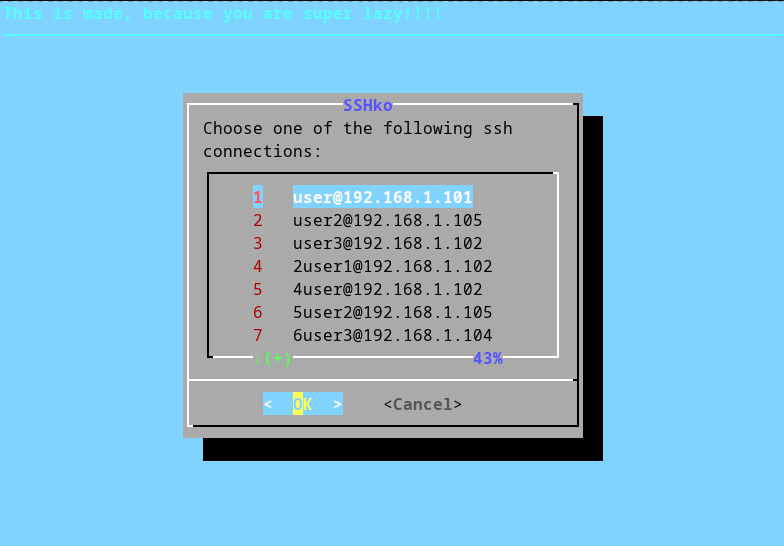

+++
title = "SSHKo: A Handy SSH Connection Manager"
date = 2024-12-25
description = "SSHKo is a powerful yet simple tool for anyone who regularly uses SSH connections. With its intuitive interface and automated logging, it’s the perfect companion for system administrators, developers, and anyone else working with remote servers. Say goodbye to the hassle of remembering IPs and usernames – let SSHKo do the work for you."
+++


Are you someone who constantly juggles between multiple SSH connections but struggles to remember all the IPs and usernames? Do you wish for a simpler, more efficient way to manage these connections without the hassle of typing in commands every time? Look no further! SSHKo is here to simplify your SSH experience.
<!-- more -->
## What Is SSHKo?

SSHKo is a lightweight and efficient SSH connection manager designed for those of us who want to streamline the process of connecting to remote servers. With SSHKo, you don’t have to remember each server’s IP address or username. It keeps track of your connections and provides a user-friendly interface to choose from previously used SSH sessions.

## Why Use SSHKo?
If you’re someone who:

* Finds it tedious to remember multiple SSH connection details.
* Wants to automate the process of managing SSH sessions.
* Prefers a simple solution that doesn’t require a bulky setup.

Then SSHKo is perfect for you. It’s lightweight, easy to install, and makes your life easier.
## How Does It Work?

SSHKo saves every SSH connection you use in a log file (~/.sshLog.txt). Whenever you want to reconnect, it reads this file and displays all previously used connections in an interactive dialog, allowing you to select the desired session.

## Getting Started
Follow these steps to start using SSHKo:
### Step 1: Install and Set Up SSHKo

1. Copy the `sshko.sh` script to a directory of your choice (e.g., `~/sshko.sh`).
2. Add an alias for the script in your shell configuration file (e.g., `~/.bashrc` or `~/.zshrc`):

```bash
alias sshko="~/sshko.sh $@"
```
3. Reload your shell configuration:
```bash
source ~/.bashrc
```

### Step 2: Run SSHKo
To start using SSHKo, simply type:

```bash
sshko
```
If it’s your first time, you’ll see the message:
```bash
ssh log file is empty
```
### Step 3: Save and Use SSH Connections

Use SSHKo with an SSH connection like this:
```bash
sshko user@192.168.1.101
```
This will:

1. Save the connection details to the `~/.sshLog.txt` file.
2. Execute the SSH connection, prompting you for the password as usual.

The next time you run `sshko` without any arguments, it will present you with a dialog box listing all saved connections (as shown in the image above). Simply select the desired connection and press Enter to connect.

## Key Features
* Automatic Logging: Keeps track of all SSH connections in a simple text file.
* Interactive Interface: Provides a clean dialog box to choose from saved connections.
* Simple Setup: No complicated installations or dependencies – just a shell script.

## Requirements
* SSH must be installed on your system.
* A bash-compatible shell.

## Benefits

* Saves time and effort by eliminating the need to remember and type SSH connection details.
* Keeps your workflow organized and efficient.
* Lightweight and portable – it’s just a script!

## Example Workflow
1. Use SSHKo to connect to a new server:
```bash 
sshko user@192.168.1.101
```
2. Reuse the connection later by simply typing:
```bash 
sshko
```

3. Select your desired server from the dialog box and connect instantly.

Happy SSHing! 🚀


