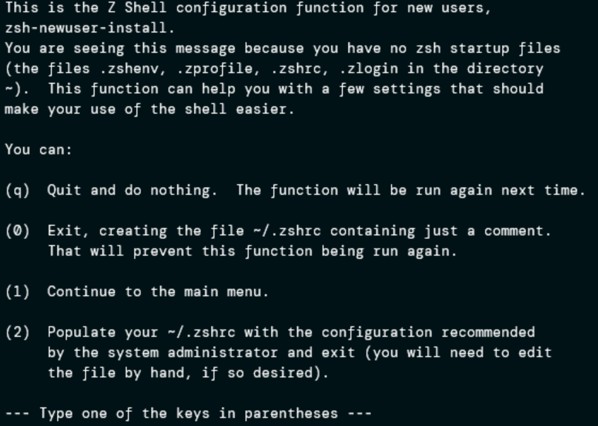

+++
title = "ZSH FTW!!!!"
date = 2024-01-12
description = "ZSH is the best DevOps choice and here is why"
+++


1. Install zsh
```bash
sudo apt update
sudo apt install zsh
```
2. Check if you have ZSH installed:

```bash
which zsh
```
If everything is fine , you should see:

```bash
/usr/bin/zsh
```
3. Set ZSH as default shell 

```bash 
chsh -s $(which zsh)
```

You may need to log out the current user and log back in. \
Then uou will need to set up the default configuration.
 \
select 0, which will create an empty .zshrc configuration file. \

Install oh-my-zsh
```bash
sh -c "$(curl -fsSL https://raw.github.com/ohmyzsh/ohmyzsh/master/tools/install.sh)"
```
Install plugins:

```bash
git clone https://github.com/zsh-users/zsh-autosuggestions ${ZSH_CUSTOM:-~/.oh-my-zsh/custom}/plugins/zsh-autosuggestions
git clone https://github.com/zsh-users/zsh-syntax-highlighting.git ${ZSH_CUSTOM:-~/.oh-my-zsh/custom}/plugins/zsh-syntax-highlighting
nano .zshrc
```
add these values

```bash
plugins=(git zsh-autosuggestions zsh-syntax-highlighting)
```

Reload the ZSH configuration:

```bash
source .zshrc
```